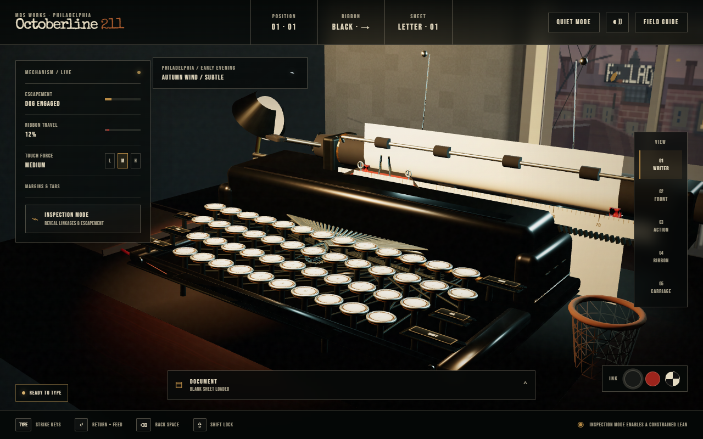

# Octoberline 211

An enthusiast-grade, browser-based simulation of a late-1930s manual typewriter at a stationary Philadelphia rowhouse desk. A physical keyboard drives the modeled keys, levers, typebars, ribbon, ink impression, escapement, carriage, platen, and paper.

[Open Octoberline 211](https://octoberline211.com/) · [Roadmap](docs/ROADMAP.md) · [Release history](https://github.com/alimabsoute/meridian-no-88-typewriter/releases)



## September 2026 update

The living Philadelphia exterior includes animated Cira lights, the preserved PECO crown, detailed masonry, moving trees and settling leaves. The compact workbench and paper mechanics remain intact. Mechanical key audio has a stronger layered impact; the landing adds a cinematic camera arrival, pointer response, and staged typography. See [release evidence](docs/releases/2026-09-13/) and [the twelve architectural concepts](design-review/philadelphia-window-concepts/index.html).

## Earlier release status

The package version remains `0.2.0` while the next release is prepared on
`codex/octoberline-phases-0-5`. Phases 0–5 and the honest Phase 6–7 previews are
implemented, release-verified, and published from `main`. The approved Carbon
Mark and Quiet Desk at Dusk homepage now form the live entry experience at
[octoberline211.com](https://octoberline211.com/).

See [PROJECT_STATUS.md](PROJECT_STATUS.md) for the evidence boundary and [the roadmap](docs/ROADMAP.md) for active and deferred work.

> **Hosting name:** the product and Vercel project are Octoberline 211. The existing GitHub repository and Pages endpoint still use the legacy `meridian-no-88-typewriter` slug; the canonical production experience is [octoberline211.com](https://octoberline211.com/).

## What works

- Immediate physical-keyboard correspondence across the complete US QWERTY layout
- Overlapping key, lever, typebar, ribbon-vibrator, escapement, and carriage motion without a serialized animation backlog
- A collision-tested open keyboard bay with no key tops protruding through the shell
- Black, red, and stencil ribbon positions, incremental spool travel, reversal, and imperfect ink impressions
- Authentic Space, Backspace overstriking, Tab, independent Shift keys, Shift Lock, margin stop, bell, carriage return, platen rotation, and line feed
- Curved paper constrained around the platen, feed rollers, guides, and bail rollers
- Physical paper rituals: release, inspect, reinsert, file beside the machine, deliberately crumple, discard, recover, and load a fresh sheet
- Page-addressed local manuscript and wastebasket storage with journal/primary/backup recovery, integrity checks, and stale-tab protection
- Exact text and full-resolution PNG export
- A visual paper desk with selectable loaded, loose, filed, and discarded sheets;
  PNG, JPEG, WebP, carbon-copy, and native Print / Save PDF paths
- Adjustable carriage margin stops, configurable tabs, and Light/Medium/Heavy touch
- Quiet Writing Mode, explicit input state, first-sheet coaching, compact mobile
  camera/mechanics controls, and independently pausable atmosphere
- An approved live-room homepage with silent key preview, a mechanical field-guide
  route, responsive Philadelphia framing, and a direct glide into Front view
- A fixed Philadelphia writing room with Clear Dusk, Autumn Wind, Steady Rain,
  First Snow, and Nor'easter presets
- Independent machine, paper, room, weather, and optional unease audio controls
- Constrained inspection views, reduced motion, mobile text input, and a built-in mechanical field guide

## Use the published baseline

Open the production experience at [octoberline211.com](https://octoberline211.com/). The legacy GitHub Pages URL may remain visible until the GitHub repository is deliberately renamed.

Once this branch is committed, merged, and published, download
`Octoberline-211-Typewriter.html` from [Releases](https://github.com/alimabsoute/meridian-no-88-typewriter/releases),
double-click it, and enter the machine. The standalone file makes no network
requests and needs a current WebGL 2 browser with graphics acceleration.

### Controls

- Type normally to operate the matching modeled keys.
- `Enter` returns the carriage and feeds the paper.
- `Backspace` moves one pitch backward without erasing, allowing an overstrike.
- `Tab`, `Shift`, `Caps Lock`, `Space`, and both physical Shift keys operate their corresponding mechanisms.
- `F6` briefly releases the margin.
- Open **Document** to export or decide a sheet's physical fate.
- Enable **Inspection Mode** before using the pointer to lean, tilt, or inspect mechanisms.

## Develop locally

Requirements:

- Node.js `22.12` or newer is recommended; Node.js `20.19` or newer is also supported.
- A current Chrome, Chromium, or Microsoft Edge installation for browser verification.
- If the browser is installed in a nonstandard location, set `CHROME_PATH` to its executable.

```bash
npm ci
npm run dev
```

Complete release validation is one command:

```bash
npm run verify
```

`verify` runs 115 unit tests, builds and checks both release packages, exercises
mechanics, paper persistence, Phase 1–5 UI and exports, proves direct-file/offline
behavior, checks default and high quality, measures structural and CPU budgets,
regenerates the 15-view simulator matrix, and validates both coming-soon previews.
Browser checks reuse an Octoberline 211 preview already running on port `4177`;
otherwise they start an isolated preview and stop only the process they created.

The current integrated result is recorded in `PROJECT_STATUS.md`. Rerun
`npm run verify` after any later product or release edit.

Verification treats browser input handling, deterministic mechanics timing, and rendered output as separate gates. Wall-clock strike limits apply only on cadence-qualified runners; timings from throttled software renderers remain visible diagnostics rather than false failures.

The Pages build is `dist/index.html`, with preview-only Phase 6 and 7 routes at
`dist/coming-soon/community/` and `dist/coming-soon/writing-board/`. The build
keeps the simulator self-contained while copying only those pages' runtime CSS,
JavaScript, procedural artwork, and local font files; review screenshots and test
scripts are excluded.

Release packaging generates the identical standalone simulator at
`dist/Octoberline-211-Typewriter.html`, a complete web package at
`dist/Octoberline-211-Web-Experience.zip`, and SHA-256 coverage in
`dist/release-manifest.json`:

```bash
npm run build:release
```

Individual browser checks may also target an existing deployment by setting `TARGET_URL`. Their default local preview is managed automatically.

Third-party software and font licenses are recorded in [THIRD_PARTY_NOTICES.md](THIRD_PARTY_NOTICES.md).

## Research basis

The fictional Octoberline 211 combines documented manual-typewriter mechanisms with Philadelphia's living repair and writing culture:

- [IBM Typewriter Service Manual (1939)](https://site.xavier.edu/polt/typewriters/IBMservice1939.pdf)
- [U.S. Army TM 37-305: Typewriter Maintenance](https://www.maritime.org/doc/typewriter/index.php)
- [Escapement mechanism patent US2212435A](https://patents.google.com/patent/US2212435A/en)
- [Ribbon vibrator patent US1417908A](https://patents.google.com/patent/US1417908A/en)
- [Line-spacing mechanism patent US2021195A](https://patents.google.com/patent/US2021195A/en)
- [Richard Polt's ribbon FAQ](https://site.xavier.edu/polt/typewriters/tw-faq.html)
- [Philly Typewriter community and public-machine program](https://www.phillytypewriter.com/community.html)
- [Philly Typewriter restoration process](https://www.phillytypewriter.com/restorations.html)
- [PECO Crown Lights 2020 relaunch](https://www.pecoconnection.com/2020/11/10/powering-on-pecos-iconic-crown-lights/)
- [Philadelphia Sign Company Crown Lights specifications](https://www.pscosigngroup.com/client-results/peco/)
- [The Lighting Practice Crown Lights study](https://www.thelightingpractice.com/project/peco-crown-lights/)

The PECO Building scene is an original procedural landmark study. No source
photographs or video frames are bundled, and Octoberline 211 is not affiliated
with or endorsed by PECO.

## Publishing

Every push to `main` runs the complete release verification with the hosted runner's Chrome installation, rebuilds the single-file simulator, preview routes, named release asset, and deterministic web ZIP, and deploys `dist/` to GitHub Pages through `.github/workflows/pages.yml`. The verified prebuilt `dist/` artifact is also deployed to the Vercel production project at [octoberline211.com](https://octoberline211.com/).

Copyright © 2026 alimabsoute. All rights reserved.
