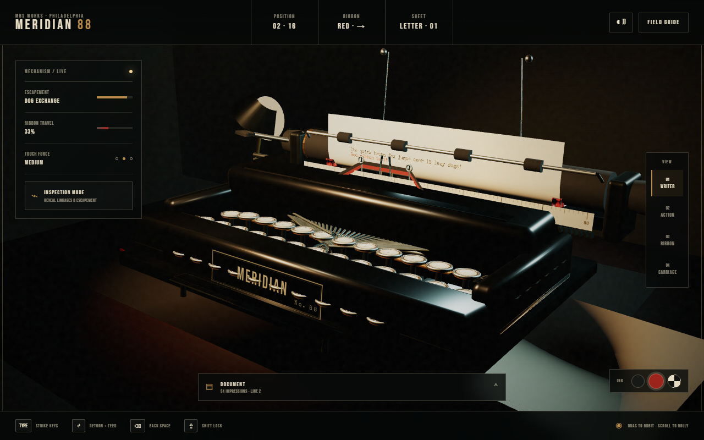

# Meridian No. 88

An unusually detailed, browser-based simulation of a late-1930s manual typewriter. The fictional Meridian No. 88 combines a museum-style presentation with a mechanically legible key-to-paper workflow.

[Open the live simulator](https://alimabsoute.github.io/meridian-no-88-typewriter/) · [Download the standalone version](https://github.com/alimabsoute/meridian-no-88-typewriter/releases/latest)



## Current status

This is a working **v0.1.0 alpha checkpoint**. It is already enjoyable and functional, but it is intentionally being preserved as work in progress. See [PROJECT_STATUS.md](PROJECT_STATUS.md) for the exact known issue and next step.

## What works

- Physical keyboard input mapped to individual 3D keys and typebars
- Moving key levers, linkages, rigid typebars, ribbon vibrator, escapement dogs, rack, drawband, carriage and platen
- Curved paper that wraps around the platen and advances during carriage return
- Black, red and stencil ribbon positions with spool travel and reversal
- Margin bell, line lock, margin release, Tab, Shift Lock and realistic Backspace overstriking
- Procedural mechanical audio
- Clickable 3D controls, inspection mode and four camera views
- Mobile text input
- Persistent page state plus PNG and text export
- Built-in field guide covering operation and researched mechanics

## Use it

The easiest option is the [live GitHub Pages version](https://alimabsoute.github.io/meridian-no-88-typewriter/).

For offline use, download `Meridian-No-88-Typewriter.html` from the [latest release](https://github.com/alimabsoute/meridian-no-88-typewriter/releases/latest), double-click it, and choose **Enter the Studio**. It needs a current WebGL 2 browser such as Chrome, Edge, Firefox or Safari.

### Controls

- Type normally to operate the character keys.
- `Enter` returns the carriage and feeds the paper.
- `Backspace` moves the carriage backward without erasing, allowing an overstrike.
- `Tab`, `Shift`, `Caps Lock`, `Space` and both Shift keys operate their corresponding mechanisms.
- `F6` releases the margin briefly.
- Drag to orbit the camera and scroll to dolly.

## Develop locally

```bash
npm ci
npm run dev
```

Validation:

```bash
npm test
npm run build
```

The production build is a single self-contained file at `dist/index.html`.

Third-party software and font licenses are recorded in [THIRD_PARTY_NOTICES.md](THIRD_PARTY_NOTICES.md).

## Research basis

The simulation was informed by period service documentation and patents, including:

- [IBM Typewriter Service Manual (1939)](https://site.xavier.edu/polt/typewriters/IBMservice1939.pdf)
- [U.S. Army TM 37-305: Typewriter Maintenance](https://www.maritime.org/doc/typewriter/index.php)
- [Escapement mechanism patent US2212435A](https://patents.google.com/patent/US2212435A/en)
- [Ribbon vibrator patent US1417908A](https://patents.google.com/patent/US1417908A/en)
- [Line-spacing mechanism patent US2021195A](https://patents.google.com/patent/US2021195A/en)
- [Richard Polt's ribbon FAQ](https://site.xavier.edu/polt/typewriters/tw-faq.html)

## Publishing

Every push to `main` runs the unit tests, rebuilds the single-file simulator and deploys `dist/` to GitHub Pages through the workflow in `.github/workflows/pages.yml`.

Copyright © 2026 alimabsoute. All rights reserved.
